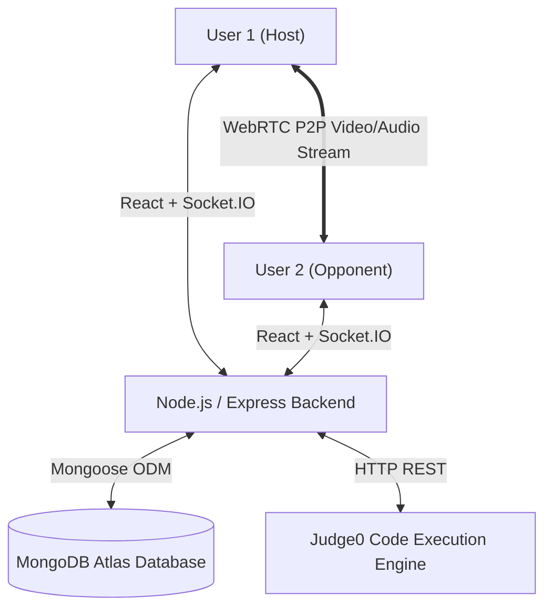

# ⚔️ CodeBattleArena — Competitive Coding & Real-Time 1v1 Battle Platform

> **Tagline**: *"CodeBattleArena: Where Coders Clash"*

CodeBattleArena is a production-grade full-stack web application that combines LeetCode-style algorithmic coding practice with BGMI-style real-time 1v1 competition. Users can practice coding problems, enter 1v1 battle rooms, compete head-to-head on the same problem in real time, stream optional WebRTC audio/video feeds, earn rating points & XP rewards, view performance analytics with AI hints, and climb the global leaderboard.

---

## 🌟 Key Features

- **🔐 Secure Authentication**: JWT authentication with `bcryptjs` password hashing and protected client routes.
- **💻 Multi-Language Practice Arena**: Monaco Code Editor supporting **JavaScript (Node.js)**, **Python 3**, **C++ (GCC)**, **C (GCC)**, and **Java (OpenJDK)** with dynamic starter templates and test-case validation.
- **⚡ Real-Time 1v1 Coding Competition**: BGMI-style 1v1 rooms with room codes or rating-based automated matchmaking queue.
- **⏱️ Synchronized 3..2..1 Countdown & 10-Minute Battle Clock**: Authoritative server-side battle timers and state management.
- **👀 Live Opponent Status Tracking**: Real-time Socket.IO broadcasts (`⌨️ Coding...`, `📤 Submitted...`, `✅ Accepted!`).
- **🏆 Server-Side Rating & XP System**: Winner (+25 Rating, +25 XP), Loser (-15 Rating, +5 XP), and Draw handling.
- **📹 Optional WebRTC Video/Audio Calling**: Peer-to-peer live camera and microphone streams during battles (100% optional, zero video storage).
- **📊 Performance Analytics & Weak Topic Detection**: Analyzes submission history to identify weak algorithm topics (Arrays, Hash Tables, Dynamic Programming, etc.).
- **🎖️ Badges & Achievements System**: Unlockable milestones for problem counts, win streaks, and rating ranks.
- **🔥 Daily Challenge System**: Featured daily problem with streak multipliers and +50 XP bonus rewards.
- **💡 AI Hint & Code Complexity Assistant**: Contextual algorithmic hints and $O(N)$ / $O(1)$ complexity breakdown.
- **🛡️ Production Security & Rate Limiting**: Security headers (`XSS`, `nosniff`, `clickjacking`), payload bounds, and IP-based rate limiting.

---

## 🛠️ Technology Stack

### **Frontend**
- **Framework**: React.js 19 (Vite)
- **Routing**: React Router DOM v7
- **Code Editor**: `@monaco-editor/react` (Monaco Editor)
- **Real-Time Sockets**: `socket.io-client`
- **HTTP Client**: `axios`
- **Styling**: Custom Obsidian Dark Cyber CSS System (`Inter` & `Fira Code` fonts)

### **Backend**
- **Runtime**: Node.js & Express.js
- **Database**: MongoDB Atlas with Mongoose ODM
- **Real-Time Sockets**: Socket.IO Server
- **Security**: JWT (`jsonwebtoken`), `bcryptjs`, Custom Rate Limiter
- **Execution Service**: Judge0 API / Dynamic Execution Engine

---

## 📐 System Architecture



---

## 🚀 Getting Started & Local Setup

### **Prerequisites**
- Node.js (v18+ recommended)
- npm or yarn
- MongoDB Atlas account (or local MongoDB)

### **1. Clone Repository & Setup Environment**
```bash
git clone https://github.com/YOUR_USERNAME/CodeBattleArena.git
cd CodeBattleArena
```

### **2. Backend Setup**
```bash
cd backend
npm install
```

Create a `.env` file inside `backend/`:
```env
PORT=3000
MONGO_URI=your_mongodb_atlas_connection_string
JWT_SECRET=your_jwt_secret_key
```

Seed 55+ LeetCode problems into MongoDB Atlas:
```bash
node seedProblems.js
```

Start Backend Server:
```bash
npm run dev
```

### **3. Frontend Setup**
```bash
cd ../frontend
npm install
```

Create a `.env` file inside `frontend/`:
```env
VITE_API_URL=http://localhost:3000
```

Start Frontend Dev Server:
```bash
npm run dev
```

Open `http://localhost:5173` in your browser!

---

## 🌐 API Endpoints Overview

| Method | Endpoint | Description |
| :--- | :--- | :--- |
| `POST` | `/api/auth/signup` | Register new account |
| `POST` | `/api/auth/login` | Login and receive JWT token |
| `GET` | `/api/auth/stats` | Fetch current user stats & profile |
| `GET` | `/api/problems` | List all 55+ coding problems |
| `GET` | `/api/problems/:id` | Get details for specific problem |
| `POST` | `/api/code/run` | Execute code with test inputs |
| `POST` | `/api/code/submit` | Submit code solution & calculate verdict |
| `POST` | `/api/battles/create` | Create a 1v1 battle room |
| `POST` | `/api/battles/join` | Join existing battle room by code |
| `POST` | `/api/battles/start` | Host starts battle (assigns random problem) |
| `GET` | `/api/battles/history` | Fetch user match history |
| `POST` | `/api/matchmaking/join` | Join rating-based automated queue (±150) |
| `GET` | `/api/leaderboard` | Fetch global rankings (sorted by rating & XP) |
| `GET` | `/api/analytics/my` | Fetch user accuracy, difficulty breakdown & weak topics |
| `GET` | `/api/achievements/my` | Fetch user badges & milestones progress |
| `GET` | `/api/daily/today` | Fetch today's featured daily challenge |
| `POST` | `/api/ai/hint` | Request AI algorithmic hint |
| `POST` | `/api/ai/complexity` | Analyze time & space complexity |

---

## 🎓 College / Viva Project Presentation Outline

1. **Introduction & Project Title**: CodeBattleArena — Competitive 1v1 Coding Platform.
2. **Problem Statement**: Standard platforms (LeetCode, HackerRank) only focus on solo practice without real-time multiplayer competition.
3. **Proposed System**: Combining LeetCode practice with real-time BGMI-style 1v1 battles, ratings, automated matchmaking, WebRTC video feeds, and AI performance analytics.
4. **Core Technical Highlights**:
   - WebSockets (Socket.IO) for synchronized countdowns and opponent status.
   - WebRTC for peer-to-peer audio/video streaming.
   - Server-Authoritative state validation for ratings, XP, and winner determination.
   - Algorithmic weak topic detection based on submission failure rates.
5. **Demonstration**: Signup -> Login -> Practice Arena -> 1v1 Battle Lobby -> 3..2..1 Countdown -> Real-Time Coding -> Victory/Defeat Rewards -> Leaderboard.
6. **Future Scope**: Elo rating matchmaking, support for Python/C++/Java runtimes, and AI code generation.

---

## 📜 License
Distributed under the ISC License. Designed and developed for CSE Capstone Project.
